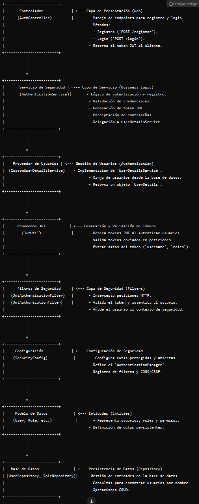

### Autenticación y Autorización de un usuario con Spring Security y JWT token.

--------------------------------------------------------

#### Paquete Auth(Controladores)
[AuthController](Documentacion/Authentication%20Controller.md)
[AuthService](Documentacion/AuthenticationService.md)
[RegisterRequest](Documentacion/Register%20Request.md)
[AuthenticationRequest](Documentacion/Authentication%20Request.md)
[AuthResponse](Documentacion/Authentication%20Response.md)
---------------------------------------------------------

#### Paquete Config(Configuracion e implementacion Spring Security)
[AppConfig](Documentacion/Application%20Config.md)
[SecurityConfig](Documentacion/SecurityConfig.md)
[JwtAuthFilter](Documentacion/JwtAuthenticationFilter.md)
[JwtService](Documentacion/JwtService.md)
---------------------------------------------------------

#### Paquete User (Usuario y consultas JPA)
[User](Documentacion/User.md)
[UserRepository](Documentacion/User%20Repository.md)
---------------------------------------------------------